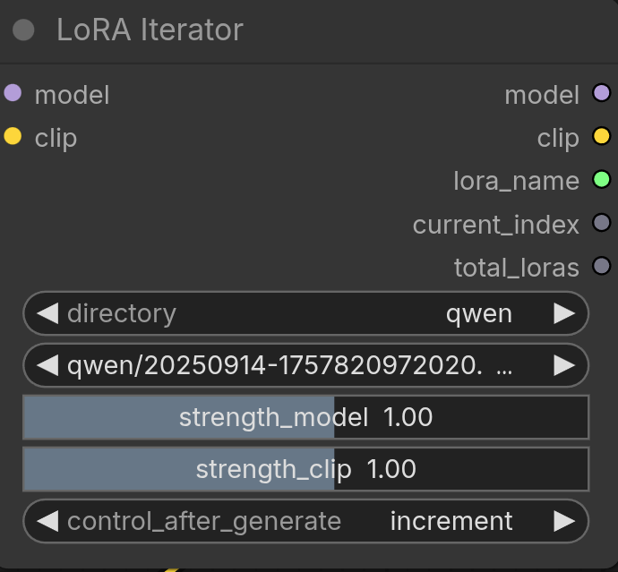

# LoRA Iterator — ComfyUI Custom Node

A ComfyUI node that automatically steps through every LoRA in a directory
(or subdirectory) on each generation run, so you can test all your LoRAs
without touching the graph between runs.

https://www.theoath.studio/projects/comfy-lora-iterator


---

## Install

```bash
cp -r lora_directory_iterator/ ComfyUI/custom_nodes/
# restart ComfyUI
```

The node appears in the node browser under **loaders/lora → LoRA Iterator**.

---

## Inputs

| Input | Type | Description |
|-------|------|-------------|
| `model` | MODEL | Base model passthrough |
| `clip` | CLIP | Base CLIP passthrough |
| `directory` | Dropdown | `[All]` or a specific subdirectory of your loras folder |
| `lora_name` | Dropdown | The currently selected LoRA (relative path) |
| `strength_model` | Float slider | LoRA strength applied to the diffusion model |
| `strength_clip` | Float slider | LoRA strength applied to the CLIP encoder |
| `control_after_generate` | Dropdown | How to advance the LoRA selection after each run |

## Outputs

| Output | Type | Description |
|--------|------|-------------|
| `model` | MODEL | Patched model with LoRA applied |
| `clip` | CLIP | Patched CLIP with LoRA applied |
| `lora_name` | STRING | Name of the LoRA used this run (useful for filename nodes) |
| `current_index` | INT | Zero-based index of the current LoRA |
| `total_loras` | INT | Total LoRAs in the selected directory |

---

## control_after_generate

This is the key feature. After each generation completes, the node advances
its internal LoRA selection according to the chosen mode:

| Mode | Behaviour |
|------|-----------|
| `fixed` | Always uses the same LoRA — nothing changes between runs |
| `increment` | Moves forward one LoRA each run. Wraps back to 0 after the last one |
| `decrement` | Moves backward one LoRA each run. Wraps to the last one after index 0 |
| `randomize` | Picks a random LoRA from the list each run |

**Example:** You have 8 LoRAs in the `zimage` directory. Set `directory` to
`zimage` and `control_after_generate` to `increment`. Queue 8 runs — each
generation automatically uses the next LoRA with zero manual intervention.

---

## Directory organisation

The `directory` dropdown shows `[All]` plus every immediate subdirectory
inside your ComfyUI loras folder. This lets you group LoRAs by the model
family they were trained on:

```
ComfyUI/models/loras/
    zimage/               ← appears as "zimage" in dropdown
        AnimeMix.safetensors
        Realism.safetensors
    sdxl/                 ← appears as "sdxl" in dropdown
        portrait.safetensors
    my_lora.safetensors   ← included when "[All]" is selected
```

Selecting `zimage` means only LoRAs trained for that model family are shown
and iterated — preventing mismatched LoRA/model combinations.

---

## Multiple instances

Each node instance tracks its own LoRA position independently using
ComfyUI's internal `unique_id`. Two LoRA Iterator nodes in the same
graph increment through their respective directories separately.

---

## Typical workflow

```
CheckpointLoader → LoRA Iterator → KSampler → VAEDecode → SaveImage
                        ↑
                  set control_after_generate = increment
                  queue N runs (one per LoRA)
```

Wire `lora_name` output into a filename prefix node to embed the LoRA name
in every saved image automatically.